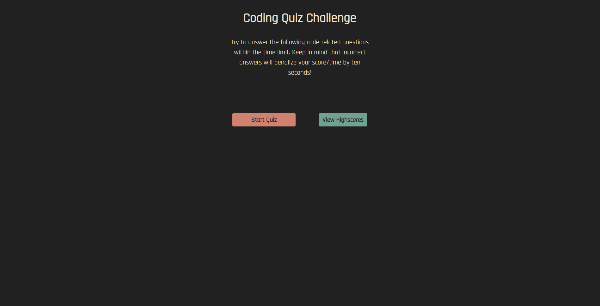

# Javascript-Quiz

---

## Description

<ul>
    <li>For this project my goal was to create a quiz that dynamically updated using vanilla JavaScript.</li>
    <li>The UI provides a clean, and simple user experience.</li>
    <li>This project was pretty intense, but great practice!</li>
    <li>After completing this project, I feel very confident in my ablility to work with JavaScript in the future.</li>
</ul>

---

## Technologies Used

<ul>
    <li>HTML</li>
    <li>CSS</li>
    <li>Javascript</li>
</ul>

---

## Link
https://mahiv87.github.io/Javascript-Quiz/

---

## Mock-up

---